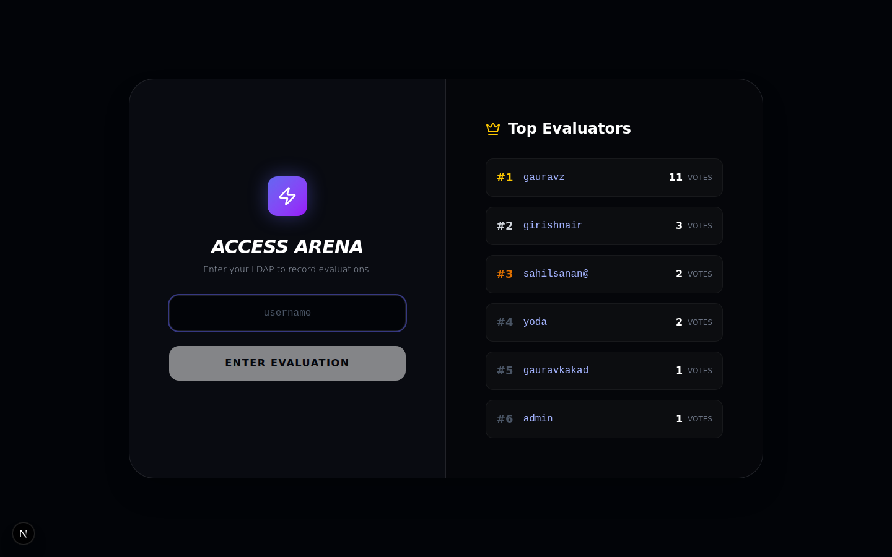
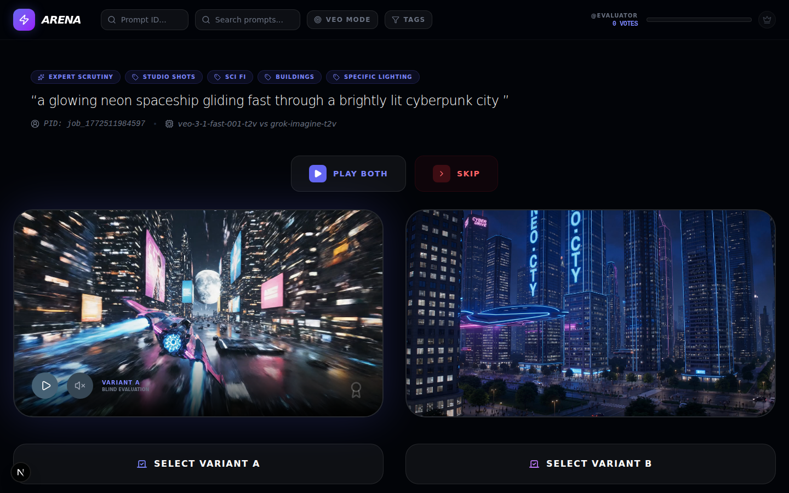
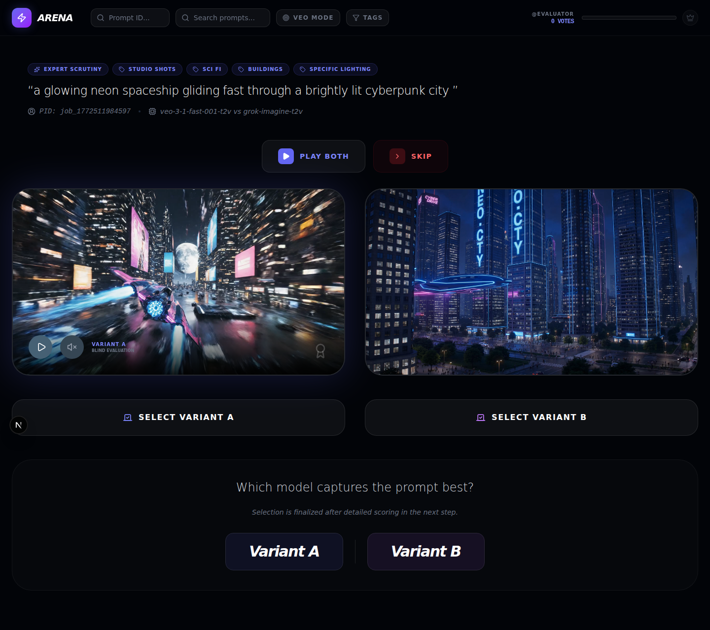
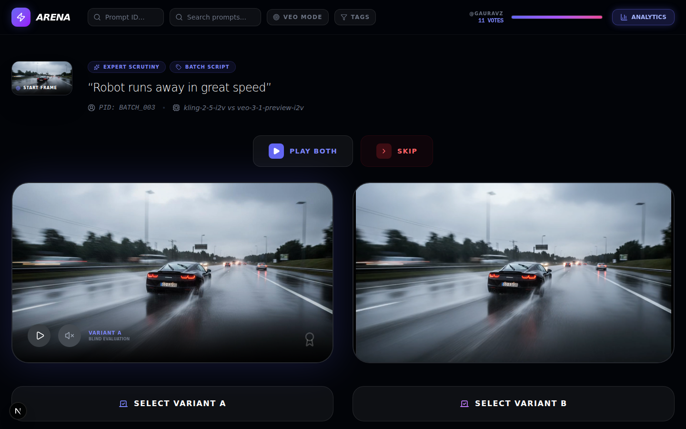
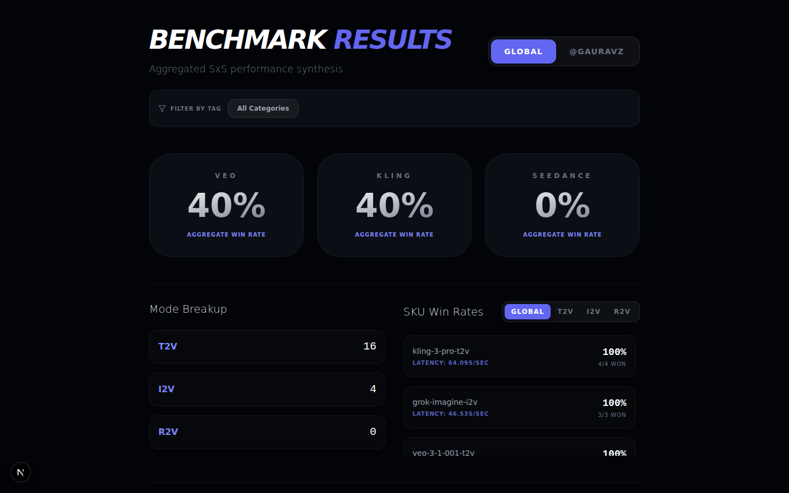
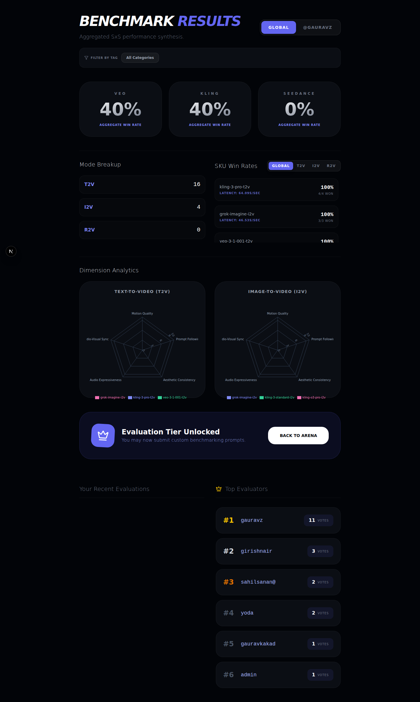
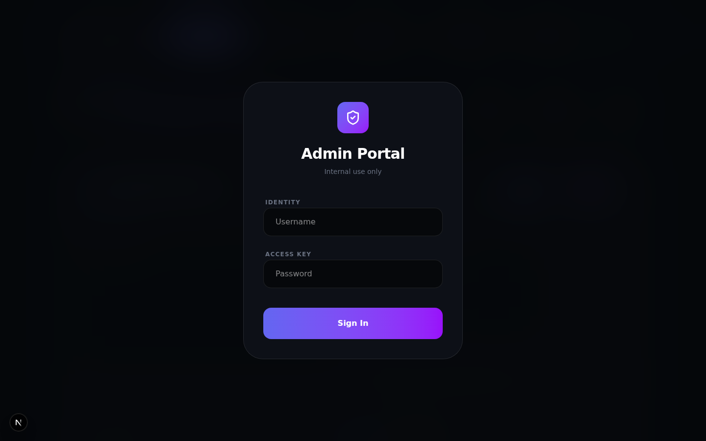
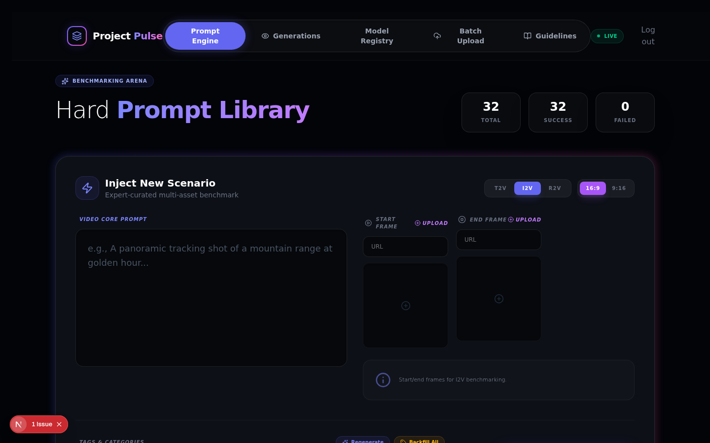
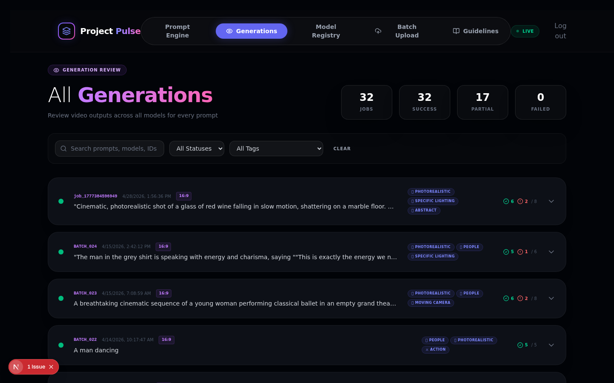
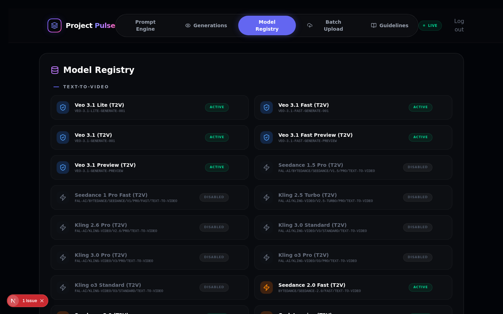

# Evaluator Guidelines: GenMedia SxS

Welcome to the GenMedia SxS Arena! As an evaluator, your input directly shapes the tuning and capabilities of generative media models. This guide walks through the platform and the metrics you should evaluate.

---

## 1. Accessing the Arena

When you first load the platform, you'll see the **Access Arena** gateway alongside the **Top Evaluators** leaderboard.

- **Leaderboard** tracks the number of completed evaluations per user in real-time.
- Enter your LDAP handle to begin blind evaluation.

---

## 2. Side-by-Side Evaluation

Once inside, you are presented with blind, anonymized pairs of video generations from the same prompt. Model identities are hidden until after you vote.

**What you see:**
- **Prompt** displayed at the top with category tags (e.g., Studio Shots, Sci Fi, Buildings).
- **Variant A / Variant B** side by side, each produced by a different model.
- **Play Both** to synchronize playback, or play individually with audio controls.
- **Skip** if the pair is not evaluable (both broken, identical, etc.).

### Voting Flow

After watching both variants, select the one that better captures the prompt. Your selection opens a detailed scoring rubric before finalizing the vote.

---

## 3. Evaluation Criteria

Rate which variant performs better across these dimensions:

| Criterion | What to look for |
|-----------|-----------------|
| **Prompt Adherence** | Does the video faithfully execute all stated elements, timings, camera movements, and visual requests? |
| **Motion Quality** | Is the movement natural and fluid? Are there temporal morphing, flickering, or bleeding artifacts? |
| **Aesthetic Quality** | Assess lighting, resolution, color grading, and cinematic quality. |
| **Physics & Cohesion** | Do objects interact realistically? Are there gravity, collision, or spatial inconsistencies? |
| **Audio Expressiveness** | If audio is present, does it match the scene's mood and energy? |
| **Audio-Visual Sync** | Are sounds timed correctly with on-screen actions? |

---

## 4. Analytics & Leaderboard

### The 10-Vote Gate

Your progress toward unlocking analytics is shown in the top-right progress bar. Once you complete **10 evaluations**, the **Analytics** button lights up and you gain access to the full benchmark dashboard.

### Benchmark Results Dashboard

The analytics dashboard shows aggregated performance data across all evaluations:

- **Aggregate Win Rates** -- Overall win percentage for each model family (Veo, Kling, Seedance).
- **Mode Breakup** -- How many evaluations were T2V (Text-to-Video), I2V (Image-to-Video), or R2V (Reference-to-Video).
- **SKU Win Rates** -- Per-model win rates with latency data, filterable by Global/T2V/I2V/R2V.
- **Dimension Analytics** -- Radar charts showing how top models score across Motion Quality, Prompt Following, Aesthetic Consistency, Audio Expressiveness, and Audio-Visual Sync.
- **Global vs. Personal** -- Toggle between global aggregate results and your own evaluation history.
- **Filter by Tag** -- Narrow results to specific prompt categories (e.g., People, Animation, Photorealistic).

### Leaderboard

The **Top Evaluators** leaderboard ranks all participants by vote count. It appears on the login screen and at the bottom of the analytics dashboard. The more you evaluate, the higher you climb.

### What you unlock at 10 votes

- Full access to the Benchmark Results dashboard
- Ability to submit custom benchmarking prompts
- "Evaluation Tier Unlocked" badge

---

## 5. Tips for Evaluators

- **Watch each video at least twice** before voting.
- **Use audio** when available -- it's a scoring dimension.
- **Don't rush** -- quality evaluations are more valuable than quantity.
- **Skip freely** if a pair is ambiguous or both outputs are equally bad/good.
- Your vote count is tracked on the leaderboard. Complete at least 10 evaluations to unlock analytics and prompt submission.

---

## 6. Admin Console (Internal)

The admin portal manages prompts, models, and batch generation workflows.

### Admin Login

### Prompt Engine

Create and manage "Hard Prompts" with support for T2V, I2V, and R2V generation modes. Upload start/end frames, tag categories, and trigger generation across all active models.

### Generations Review

Track all generation jobs with status indicators, category tags, and success/failure counts. Filter by status, tags, or search by prompt text.

### Model Registry

View and toggle all registered models. Supports Veo (Vertex AI), Kling, Seedance, and other providers via FAL.

