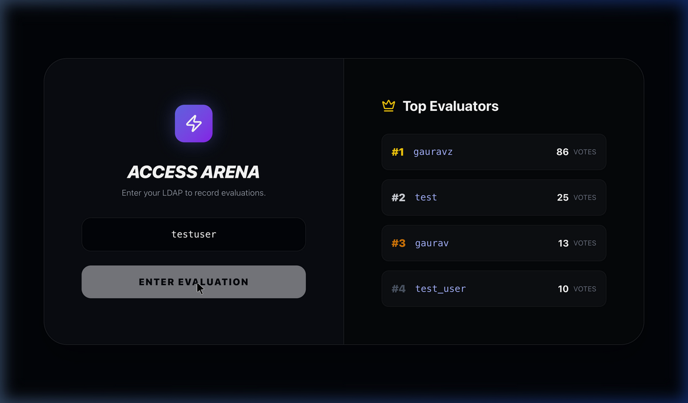
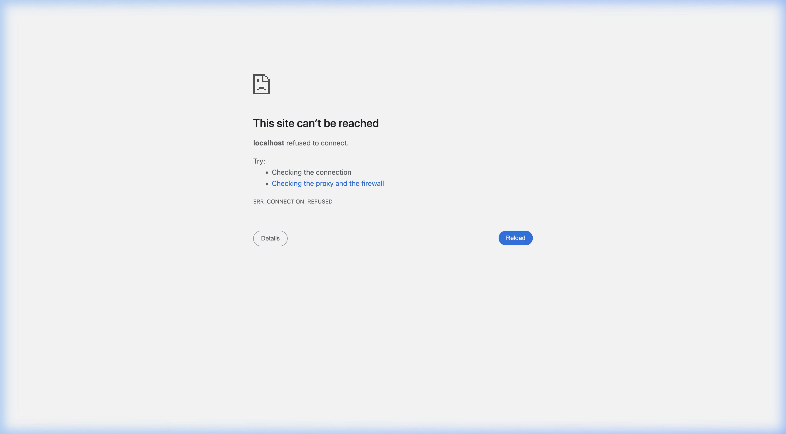

# Evaluator Guidelines: Project Pulse
Welcome to Project Pulse! As an evaluator, your input directly shapes the tuning and capabilities of the GenMedia models. This guide outlines how to use the Side-by-Side (SxS) tools and what metrics you should look for.

## 1. Accessing the Arena & Leaderboard
When you first load the platform, you will be met with the **Access Arena** gateway and the **Top Evaluators Leaderboard**.

- **Leaderboard:** Tracks the number of successful votes completed by users globally in real-time.
- **LDAP Entry:** You must provide your testing handle or LDAP to enter the blind evaluation grid.

## 2. Side-by-Side (SxS) Tool Snapshot
Once inside the Living Arena, you are presented with blind, anonymized pairs of video generations evaluated off the same underlying scenario (linked by strict mappings).

- **Prompt:** Read the requested prompt and observe any starting images (`S`) or reference images (`R`).
- **Variants:** Two anonymized variants produced by different base models (e.g., Veo, Kling, Seedance) will loop continuously.

### Evaluation Criteria (The Rubric)
You must select which video performs better based on the following:
* **Prompt Adherence:** Does the video faithfully execute all stated elements, timings, and visual requests?
* **Physics & Cohesion:** Does the movement feel natural? Are there any temporal morphing or bleeding artifacts?
* **Aesthetic Quality:** Assess lighting, resolution, and cinematic quality.

## 3. Analytics & Progress
Your individual progress will be tracked via **Gate Counts** dynamically. 
The broader metrics like **SKU Win Rates** are aggregated via the database to identify model performance gaps between prompt taxonomy (e.g., Studio Shots vs. Animation).

Thanks for participating in the improvement of our models!
